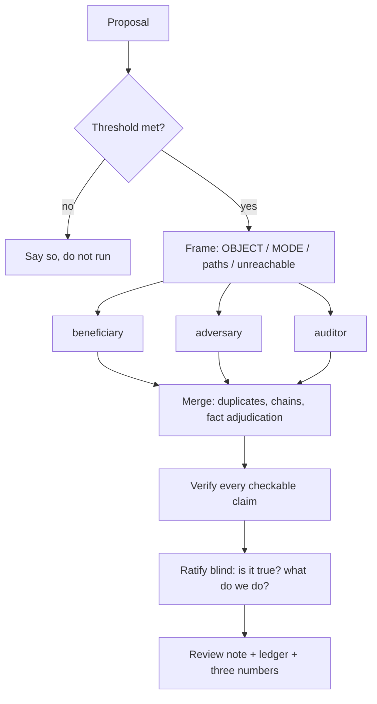

# kai-critic

An adversarial critic for Claude Code, over a proposal that reality has not yet tested. Three seats, blind to each other. Names problems, never writes solutions.

## What it is

A plugin (`/kai-critic`) that runs a **design**, a **strategy** or an **instruction** past three independent critics and hands you the merged result. The value it sells is **precision**: an accepted finding earns its keep, and a finding you have to investigate and discard costs more than it saved. Ten plausible observations are worse than three real ones, and the whole design is built around that trade.

Asking your session to "critique this" gets you a review by the author of the thing. The two mechanisms here are what makes it a different instrument:

- **The lenses run blind to each other**, in one parallel batch. Sequential runs let the second anchor on the first, and three seats collapse into one seat with an echo.
- **What we teach the agent and what we measure it by live in different files.** The desk it reads every run; the lab — ledger, precision per lens, hypotheses under test — it never reads, on any run. An agent that has read the hypothesis stops being its test.

## The three lenses

A lens is a **seat you look from**, not a topic list. Every run uses all three.

| Lens | `OBJECT: design` | `OBJECT: strategy` | `OBJECT: instruction` |
|---|---|---|---|
| **beneficiary** | the end user: does this solve the problem they have, or the one it was convenient to solve? | the person executing: does it fit their real capacity, or an ideal week? | doubled — the agent reading it cold, and the person in the session it produces |
| **adversary** | what breaks, and whether anyone would notice; what it costs to *run* | the pre-mortem: six months on, this failed — what happened? | the silent misfire; drift from the contract it claims to obey |
| **auditor** | what is **not said**, walked as a closed list of dimensions | same, strategy dimensions | same, instruction dimensions |

The auditor is deliberately built differently from the other two. It judges *absence*, and "what did we miss?" is the noisiest question you can ask a model — an answer always turns up. So it walks a fixed list instead of an open question, and a missing dimension is reportable only when the agent can name what goes wrong **for this object** because it is missing. A finding that is always true is worth nothing.

## The protocol



**Threshold.** Three passes plus your triage time is not free. Run when at least one holds: the decision is hard to reverse; it is a new contour, not an edit; the cost of being wrong is above trivial. A tax on every small design is the same negative value as an uncalibrated critic, from the other side.

**Mode is set by whether reality exists yet**, not by object type. Nothing built → `blind`: the artifact and nothing else, because any other file the agent opens is probably the author's reasoning, which is exactly what it must not absorb. An implementation or history exists → `grounded`: an explicit path list, plus an explicit list of what is **unreachable** from the session, so claims depending on those become named checks instead of findings.

**What your host attaches counts as a path.** Read a file, and the standing instructions of its directory — a `CLAUDE.md` or its equivalent — may reach the lens without anyone listing them. In `grounded` mode that is usually right, because a repository's instructions are part of its machinery when the machinery is what you are judging; the skill enumerates them and lists them anyway, so the record of a wave matches what was actually read. In `blind` mode it is not, so an artifact with anything standing above it gets inlined rather than named. Either way the lens reads such a file and does **not** obey it, and reports it in its own header.

**Merge is three jobs, not one.** Duplicates from two lenses *from different sides* go **up** in severity rather than into a merged blur. **Chains** — adjacent links of one failure, each small alone — are looked for on purpose; they are the payoff of separating the seats. And when two lenses cite different numbers from the same corpus, the discrepancy itself may be the finding.

**Ratification is blind by default, and asks you two things.** Every checkable claim is verified first — where the finding is about behaviour, verified means a reproduction, from creating the object to the wrong result. Then each finding goes to you one dialog at a time carrying that trace, the finding as the lens wrote it, and one to three fixes the main thread judges sensible, each concrete enough to act on. You answer twice: **is it true** (accept · accept with correction · downgrade · reject) and **what do we do** (one of the offered fixes · don't fix · your own). The second question exists because the first four options only ever asked whether a finding was true, so a finding whose right answer was "rebuild this" got accepted and quietly patched. Before writing a fix the main thread is required to consider all three moves — patch the place, rebuild the contour, cut the feature — and then propose whichever are actually sensible, not a ladder.

Hidden until you have ruled: the main thread's predicted ruling, its predicted choice of fix, and which lens produced the finding. All three are anchors. Afterwards you see one table — finding · lens · prediction · your ruling · agree? · the fix you chose — and three numbers: **precision** (your acceptances ÷ findings), **triage agreement** (how often the prediction matched your ruling), and **fix hit rate** (how often you took an offered fix instead of writing your own). A low agreement with a high precision means the lenses are fine and the triage is not. A low fix hit rate with a high precision means the lenses find the right things and the main thread keeps reaching for the wrong instrument, usually the small one. Both are the more useful failures.

## Install

The repo is its own plugin marketplace:

```
git clone <repo-url> kai-critic
claude plugin marketplace add ./kai-critic
claude plugin install kai-critic@kai-critic
```

Install at **user** scope — the critic is meant to be reachable from any repository. Nothing else is required: no MCP server, no API key, no dependency on other plugins.

## Usage

```
/kai-critic <the design, strategy or instruction to criticise>
```

The skill frames the run, launches the three lenses, merges, verifies, and walks you through ratification. It also fires on its own when a session has just produced a design that clears the threshold — the point is to be called *before* the work is shown, not after someone asks for a second opinion.

## Bring your own desk (and keep a lab)

The plugin ships a generic **desk** (`desk/desk_critic.md`) — the craft: techniques that have paid off, what makes a finding falsifiable, stop rules, the boundaries of the role. It is a starting point. A desk that names your projects, your recurring failure shapes and your document conventions is worth considerably more.

```
claude plugin install kai-critic@kai-critic --config desk_path=/abs/path/to/your_desk.md
```

Keep your copy **outside** the plugin: an update overwrites the bundled file and never touches yours.

A **lab** is the other half, and the plugin deliberately does not ship one. It is your file, in your repository, holding the lens ledger, precision per lens, the tics you have noticed and the hypotheses you are currently testing. The skill will update it if your repository has one. It must **never** appear in a run's allowed paths — a lens that has read its own precision starts playing to the scoreboard, and a hypothesis handed to the agent that is supposed to test it is no longer a test.

## When not to call it

- **A finished deliverable with a real recipient who has already reacted.** Reality arrived; the question is "did it work", not "will it".
- **A system that already runs.** That needs an evaluation pipeline, one per system, with no agent in the loop.
- **Code review.** Different instrument, different failure modes.
- **Small reversible edits.** See the threshold above.

## Layout

```
.claude-plugin/plugin.json       manifest + the desk_path option
.claude-plugin/marketplace.json  so the repo installs as its own marketplace
agents/kai-critic.md             the charter — one lens per invocation, Read/Grep/Glob only, no Agent tool
skills/kai-critic/SKILL.md       the run protocol: threshold, framing, launch, merge, ratification, landing
desk/desk_critic.md              the generic desk (override with desk_path)
```

The agent has no write tools. That is deliberate: it proposes desk edits in a `## Desk proposal` block and someone approves them.

## Status

`0.2.0` — see [CHANGELOG.md](CHANGELOG.md). Single author, extracted from a private vault where it has run for a series of waves on real designs. The charter and the finding format are the settled parts; the ratification protocol is newer and still moving, and it exists precisely because the earlier precision numbers were the main thread triaging objects it had written itself. Its second question — what to do about a finding, asked separately from whether the finding is true — is newer still, and the number attached to it has no observations behind it yet.

## License

MIT — see [LICENSE](LICENSE).
